# Automated OneAgent deployment in EC2 Autoscaling Group

## Summary:
- This hands-on instruction is to setup simple EC2 Autoscaling group, then install Dynatrace OneAgent
- The propose is for user to see how quickly and seamlessly to deploy OneAgent and let it performs advanced observability
- There are 5 sections
  - [Section 1: Create Application Load Balancer](#section-1:-create-application-load-balancer)
  - [Section 2: Prepare User Data Script](. "Section 2: Prepare User Data Script")
  - [Section 3: Create EC2 Autoscaling group](. "Section 3: Create EC2 Autoscaling group")
  - [Section 4: Try accessing application](. "Section 4: Try accessing application")
  - [Section 5: Scale-in and termination](#section-5:-scale-in-and-termination)

## Section 1: Create Application Load Balancer
1. In AWS Console, click on **Services**, then type and select **EC2**
2. Go to **LOAD BALANCING** > **Load Balancers** > **Click Create Load Balancer**
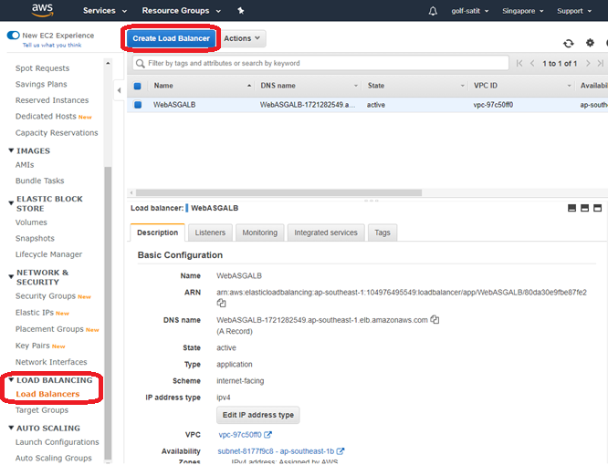

3. Click Create on Application Load Balancer
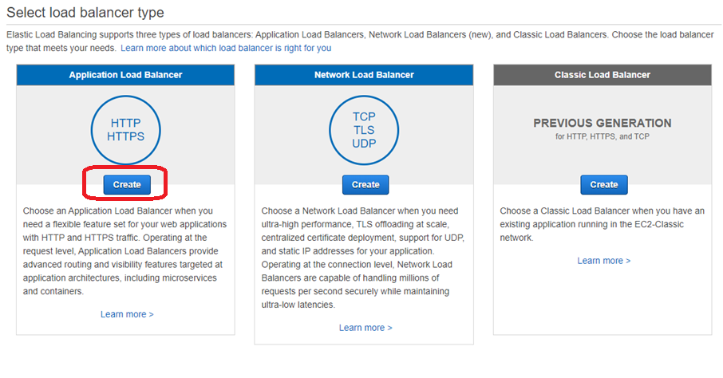

4. Step 1: Configure Load Balancer
- Set name (no space)
- Select Availability zone 1a and 1b
- Leave default settings for the rest
- Click Next
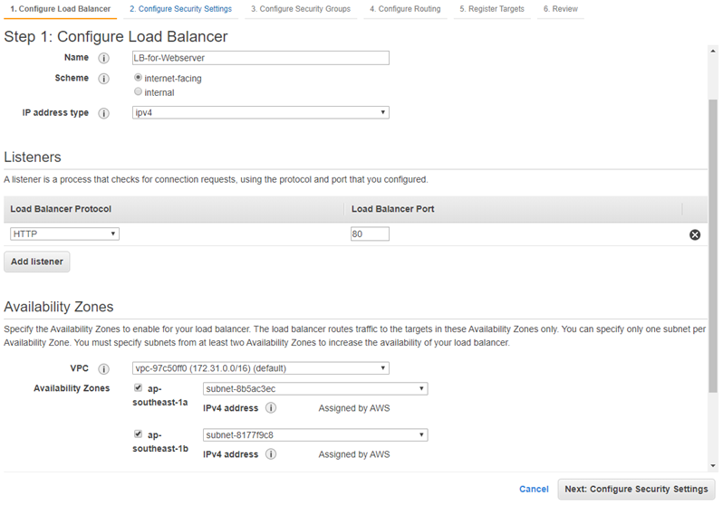

5. Notice the warning and click Next
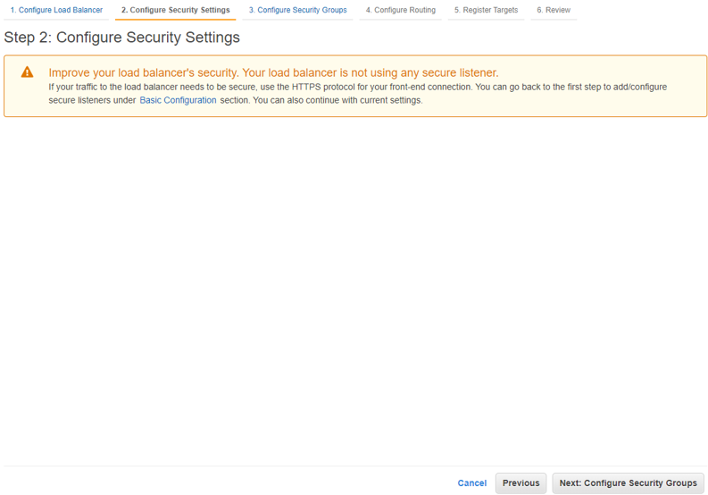

6. Step 3: Configure Security Group
- Select create a new security group
- Set group name and optionally description
- Click Next
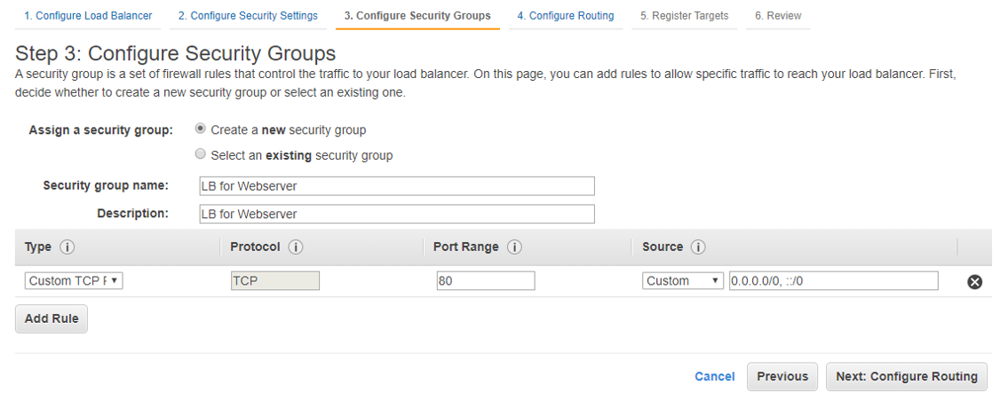

7. Step 4: Configure Routing
- Set name
- Reduce Healthy threshold 5 -> 2
- Reduce Timeout 5 -> 2
- Reduce Interval 30 -> 5
- Click Next


8. No need to add target
9. Click Next
10. Click Review
11. Click Create

### Edit Target Group Settings
12. Go to LOAD BALANCING > Target Groups
13. Select the newly created target group > 
Select Edit attributes from Actions dropdown
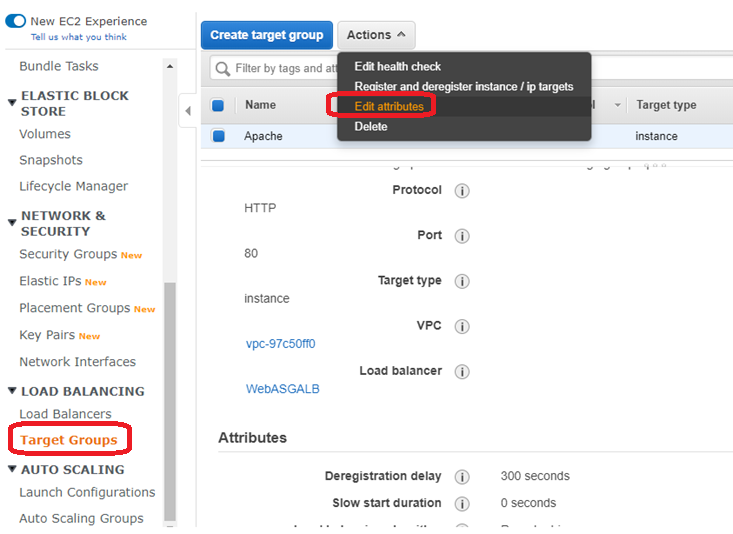
3. Change attributes as below
- Change deregistration delay to 5 sec (from 300)
- Leave stickiness disabled
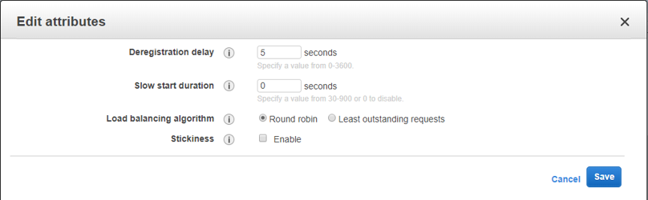

## Section 2: Prepare User Data Script
**Prerequisite:** You need to have Dynatrace SaaS tenant ready. 
If you do not have one, please register for [free trial](https://www.dynatrace.com/trial/)
1. In Dynatrace Console, from left menu, go to Manage > Deploy Dynatrace
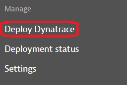
2. Click Start Installation
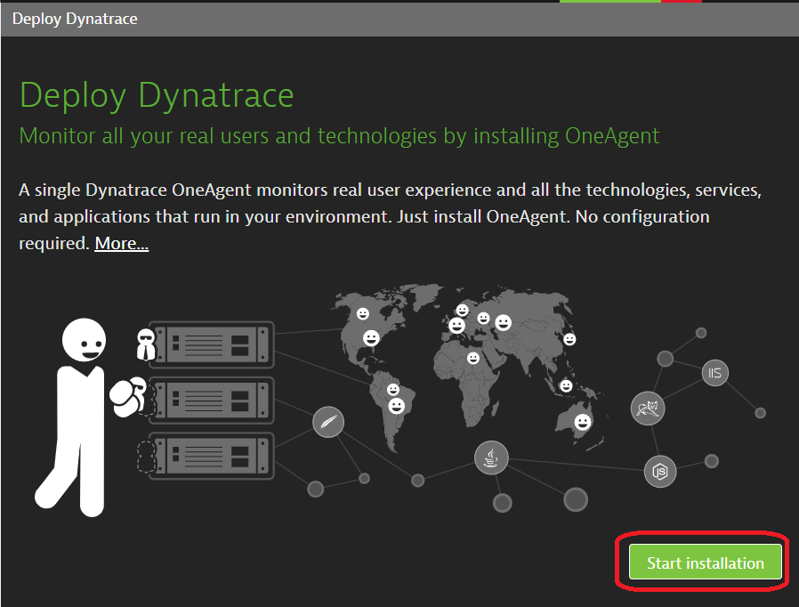
3. Click Linux
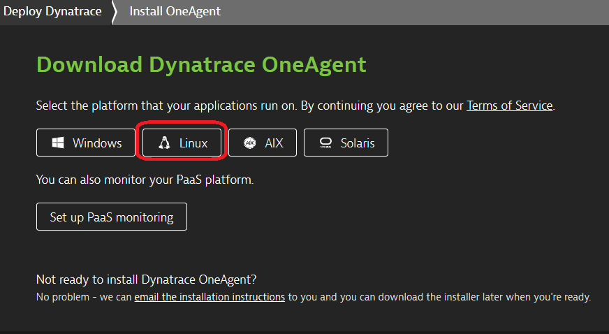
4. Copy script below to notepad and insert 1st command and 3rd command from UI in the placeholder. You will need it in Section 3.
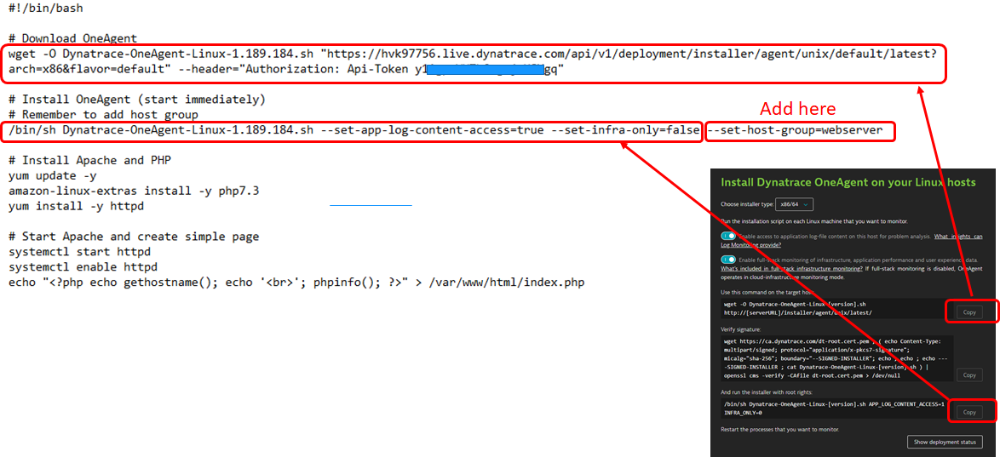

```sh
#!/bin/bash

# Download OneAgent
<<INSERT_WGET_COMMAND_HERE>>

# Install OneAgent (start immediately)
# Remember to add host group
<<INSERT_INSTALLATION_COMMAND_HERE>> --set-host-group=webserver

# Install Apache and PHP
yum update -y
amazon-linux-extras install -y php7.3
yum install -y httpd

# Start Apache and create simple page
systemctl start httpd
systemctl enable httpd
echo "<?php echo gethostname(); echo '<br>'; phpinfo(); ?>" > /var/www/html/index.php
```

## Section 3: Create EC2 Autoscaling group
### Create Launch Configuration
1. In EC2 Services, go to AUTO SCALING > Launch Configuration
2. Click Create launch configuration
3. In Step 1: Select Amazon Linux 2 AMI, Click Next
4. In Step 2: Select t2.micro, Click Next
5. In Step 3: Configure Detail like below
- Set Name
- Select Request Spot Instances
- Put Maximum price the same as current price
- Expand Advanced Details
- Set User data using script from Section 2
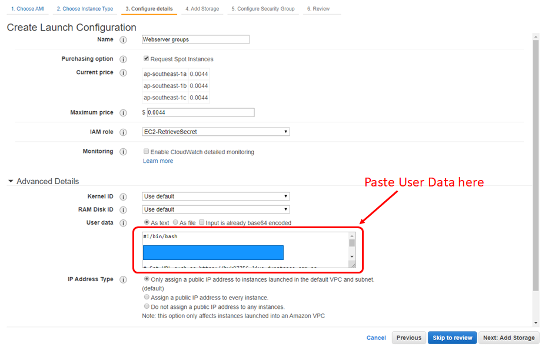
- Click Next
6. In Step 4: Click Next
7. In Step 5: Configure Security Group
- Select **Create a new security group**
- Set group name and, optionally, description
- Add Rule using
  - Type: HTTP
  - Source: Custom IP, enter sg for popup to show, then select the security group created for ALB in Section 1
  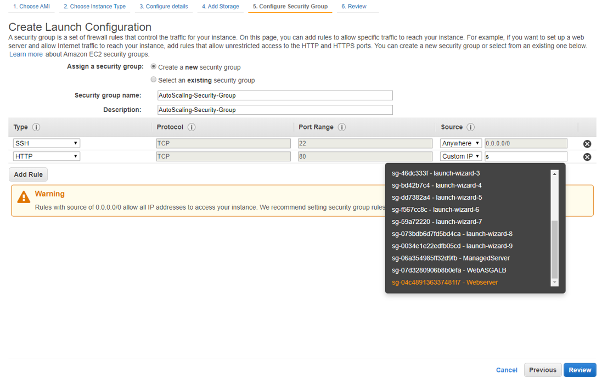
- Click Review
8. Click Create launch configuration
- Create a new keypair (You can also use your existing key, no problem)
- Click Create launch configuration
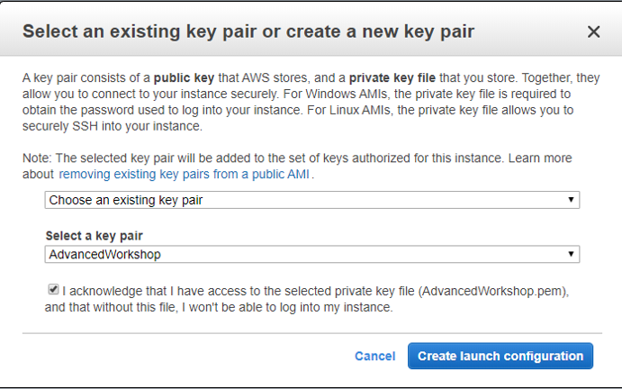

### Create Auto Scaling group
9. Click Create an Auto Scaling group using this launch configuration
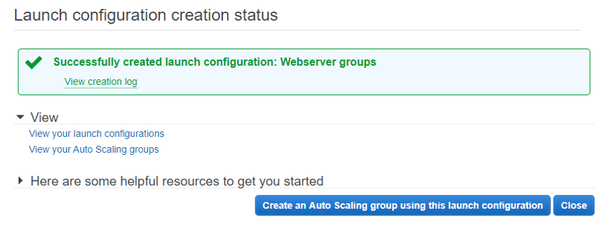
10. Configure detail like below
- Set Group name
- Set Start with 2 instances
- Select subnet for 1a and 1b
- Enable Receive traffic from one or more load balancers
- In Target Groups > Select Target group from previous section
- Select Health Check Type to ELB
- Reduce Health Check Grace Period 300 -> 60 sec
- Reduce Default cooldown 300 -> 60 sec
- Click Next
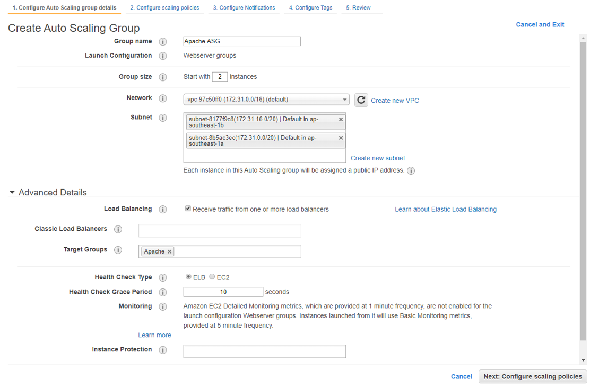
11. Click Next
12. Click Next
13. In Step 4: Add tag with Key=Name, Value=<whatever>, then click Review
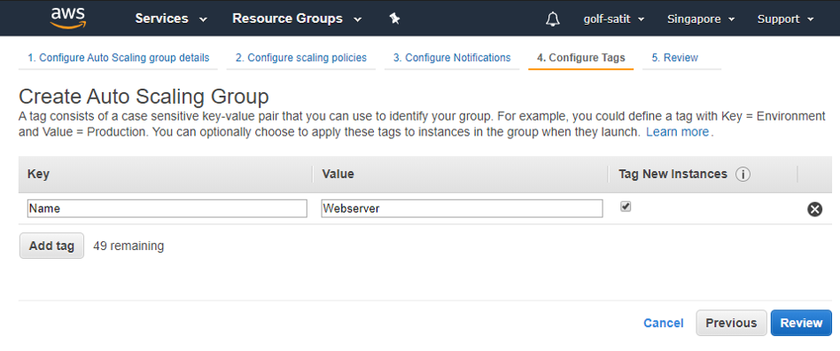
14. Click Create Auto scaling group

## Section 4: Try accessing application
1. In EC2 Console, go to INSTANCES > Instances

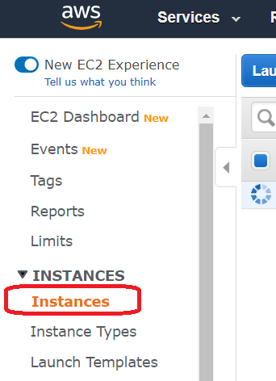

See if there are two EC2 instances created and in running state
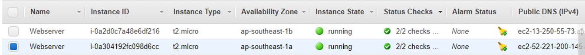
2. In Dynatrace UI, go to Monitor > Hosts

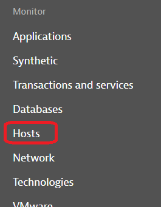

There should be two hosts showing up

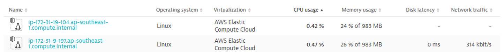
3. Go to **LOAD BALANCING** > **Load Balancers**
- Select the ALB create in Section 1
- Copy DNS Name
- Paste DNS Name in Web browser and try accessing it
- You should see hostname and PHP Version
- Press F5 a few times, you should notice the hostname keep changing

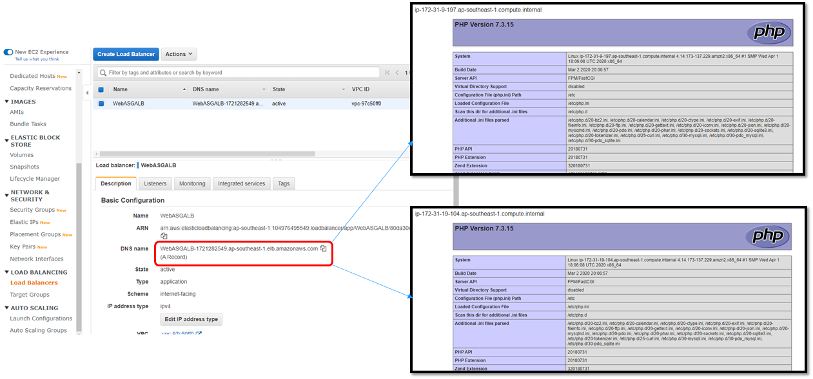

## Section 5: Scale-in and termination
1. In EC2 Console, go to INSTANCES > Instances
