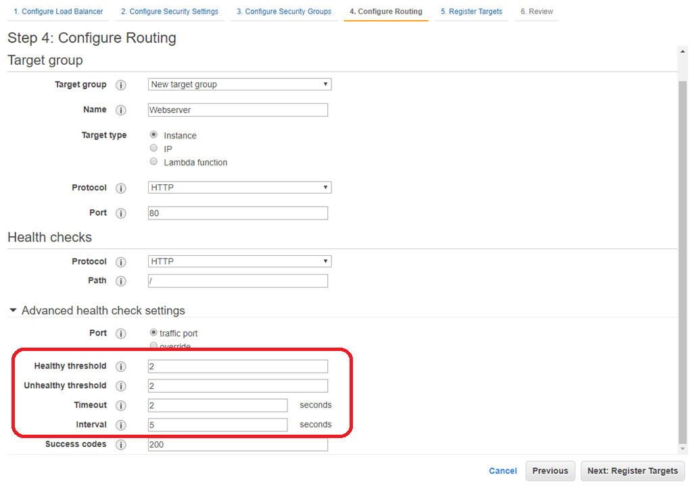

# Automated OneAgent deployment in EC2 Autoscaling Group

## Summary:
- This hands-on instruction is to setup simple EC2 Autoscaling group, then install Dynatrace OneAgent
- The propose is for user to see how quickly and seamlessly to deploy OneAgent and let it performs advanced observability
- There are 5 sections
  - [Section 1: Create Application Load Balancer](#section-1-create-application-load-balancer)
  - [Section 2: Prepare User Data Script](#section-2-prepare-user-data-script)
  - [Section 3: Create EC2 Autoscaling group](#section-3-create-ec2-autoscaling-group)
  - [Section 4: Try accessing application](#section-4-try-accessing-application)
  - [Section 5: Scale-in and termination](#section-5-scale-in-and-termination)

**Prerequisite:** 
1. You need to have Dynatrace SaaS tenant ready. 
If you do not have one, please register for [free trial](https://www.dynatrace.com/trial/)
2. You need to have AWS account with at least **EC2FullAccess** policy

## Section 1: Create Application Load Balancer
1. In AWS Console, click on **Services**, then type and select **EC2**
2. Go to **LOAD BALANCING** > **Load Balancers** > Click **Create Load Balancer**


3. Click **Create** on **Application Load Balancer**


4. Configure Load Balancer
- Set Name (without space)
- Select Availability zone **1a** and **1b**
- Leave default settings for the rest
- Click **Next**


5. Notice the warning and click **Next**


6. Configure Security Group
- Select create a **new** security group
- Set Security group name and description
- Click **Next**


7. Configure Routing
- Set Name
- Reduce Healthy threshold 5 -> 2
- Reduce Timeout 5 -> 2
- Reduce Interval 30 -> 5
- Click **Next**



8. No need to add target, click **Next**
9. Click **Review**
10. Click **Create**

### Edit Target Group Settings
11. Go to **LOAD BALANCING** > **Target Groups**
12. Select the newly created target group > 
Select **Edit attributes** from **Actions** dropdown


13. Change attributes as below
- Change Deregistration delay 300 -> 5 sec
- Leave stickiness disabled


----------------------------------

## Section 2: Prepare User Data Script

1. In Dynatrace Console, use left menu to go to **Manage** > **Deploy Dynatrace**


2. Click **Start Installation**


3. Click **Linux**


4. Copy script below to notepad and insert 1st command and 3rd command from UI in the placeholder. You will need it in Section 3


```bash
#!/bin/bash

# Download OneAgent
<<INSERT_WGET_COMMAND_HERE>>

# Install OneAgent (start immediately)
# Remember to add host group
<<INSERT_INSTALLATION_COMMAND_HERE>> --set-host-group=webserver

# Install Apache and PHP
yum update -y
amazon-linux-extras install -y php7.3
yum install -y httpd

# Start Apache and create simple page
systemctl start httpd
systemctl enable httpd
echo "<?php echo gethostname(); echo '<br>'; phpinfo(); ?>" > /var/www/html/index.php
```

----------------------------------

## Section 3: Create EC2 Autoscaling group
### Create Launch Configuration
1. In EC2 Services, go to **AUTO SCALING** > **Launch Configuration**
2. Click **Create launch configuration**
3. In Step 1: Select **Amazon Linux 2 AMI**, Click **Next**
4. In Step 2: Select **t2.micro**, Click **Next**
5. In Step 3: Configure Detail like below
- Set Name
- Select **Request Spot Instances**
- Put Maximum price the same as current price above
- Expand Advanced Details
- Set **User data** as text using script from Section 2
- Click **Next**


6. In Step 4: Click **Next**
7. In Step 5: Configure Security Group
- Select **Create a new security group**
- Set Group name and, optionally, description
- Add Rule using
  - Type: **HTTP**
  - Source: **Custom IP**, enter sg for popup to show, then select the security group created for ALB in Section 1
- Click **Review**

  

8. In Review step
- Click **Create launch configuration**
- Choose **Create a new keypair** (You can also use your existing key, no problem)
- Click **Create launch configuration**


### Create Auto Scaling group
9. Click **Create an Auto Scaling group using this launch configuration**


10. Configure detail like below
- Set Group name
- Set Start with **2** instances
- Select subnet for **1a** and **1b**
- Enable **Receive traffic from one or more load balancers**
- In Target Groups, Select Target group from previous section
- Select Health Check Type to **ELB**
- Reduce Health Check Grace Period 300 -> 60 sec
- Reduce Default cooldown 300 -> 60 sec
- Click **Next**


11. Click **Next**
12. Click **Next**
13. In Step 4: Add tag with *Key=Name*, *Value=Webserver*, then click **Review**


14. Click **Create Auto scaling group**

----------------------------------

## Section 4: Try accessing application
1. In EC2 Console, go to **INSTANCES** > **Instances**


See if there are two EC2 instances created and in **running** state


2. In Dynatrace UI, go to **Monitor** > **Hosts**


There should be two hosts showing up


3. Go to **LOAD BALANCING** > **Load Balancers**
- Select the ALB create in Section 1
- Copy value from DNS Name by click on copy icon
- Paste DNS Name value in Web browser and try accessing it
- You should see **hostname** and **PHP Version**
- Press **F5** a few times, you should notice the hostname keep changing


### Here is how the current architecture looks like


### Troubleshooting
If things are not going well, here is what you should check
- Proper Security groups inbound / outbound rules
- Review Launch configuration
- EC2 is up and running. If not, you can check log from **Instance Settings > Get System Log**


----------------------------------

## Section 5: Scale-in and termination
### Force scale-in event


1. In EC2 Console, go to **AUTO SCALING** > **Auto Scaling Groups**
2. Click on Autoscaling group created in Section 3, then click **Edit** button


3. Reduce both *Desired Capacity* and *Min* to **1**


4. Recheck result using steps from [Section 4](#section-4-try-accessing-application)
***What do you see?***

### Suddenly terminate EC2


5. In EC2 Console, go to **INSTANCES** > **Instances**
6. Select remaining EC2 created by Autoscaling group, then from **Actions** menu, **Terminate** it
7. Recheck result using steps from [Section 4](#section-4-try-accessing-application)
***What do you see?***

----------------------------------

## Clean up
### Below is the items you need to delete
1. Delete ASG
2. Delete Launch configuration
3. Delete ALB
4. Terminate all EC2

[Go to Home](#)